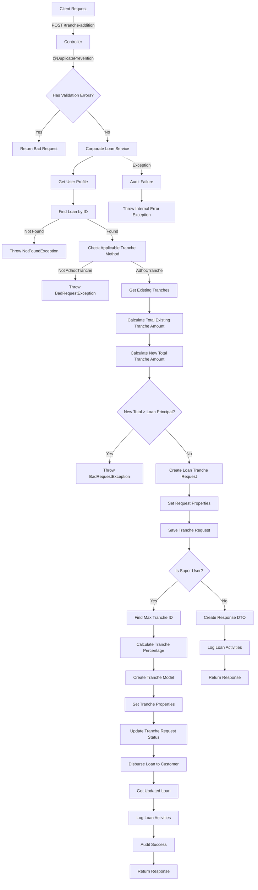
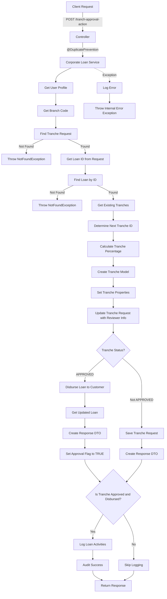

# Granular Explanation of AdHoc Tranch Addition Endpoint

This code implements a RESTful API endpoint for adding an ad-hoc disbursement tranche to an existing corporate loan with the following components:

### Controller Layer

- Defines a POST endpoint at `/tranche-addition`
- Uses `@DuplicatePrevention` annotation with a cache key of "loanId" to prevent duplicate submissions
- Accepts a tranche request body
- Validates the request and handles validation errors
- Routes the request to the corporate loan service's adHocTrancheAdditionToLoan method

### Service Layer

The service method is annotated with `@Transactional` to ensure database consistency and follows these steps:

1. **User Context**: Retrieves the current user profile
2. **Loan Retrieval**: Finds the existing loan by ID
3. **Validation**:

   - Checks that the loan supports ad-hoc tranches (applicableTranchMethod is AdhocTranche)
   - If not, throws a BadRequestException

4. **Tranche Amount Validation**:

   - Retrieves all existing tranches for the loan
   - Calculates the total existing tranche allocation amount
   - Calculates the new total tranche allocation amount (existing + new)
   - Validates that the new total doesn't exceed the loan principal
   - If it does, throws a BadRequestException

5. **Tranche Request Creation**:

   - Creates a new loan request model for the tranche addition
   - Copies properties from the original loan
   - Sets specific properties for the tranche request (principal, tenor, status, etc.)
   - Sets the loan request type to TRANCH_ADDITION
   - Saves the tranche request

6. **Super User Logic**:

   - If the user is a super user:
   - Determines the next tranche ID- Calculates the tranche percentage
   - Creates a new tranche model with appropriate properties
   - Updates the tranche request status to APPROVED
   - Calls the loan disbursement service to disburse the loan
   - Retrieves the updated loan
   - Logs loan activities
   - Records audit information

   - If the user is not a super user:

   - Creates a response DTO from the tranche request
   - Logs loan activities

7. **Exception Handling**: Catches exceptions, logs audit information for failures, and throws an InternalErrorException

## Detailed Flow Diagram

# AdHoc Tranch Approval Endpoint

This code implements a RESTful API endpoint for approving an ad-hoc disbursement tranche with the following components:

### Controller Layer

- Defines a POST endpoint at `/tranch-approval-action`
- Uses `@DuplicatePrevention` annotation with a cache key of "tranchRequestId" to prevent duplicate submissions
- Accepts a tranche checker request body
- Routes the request to the corporate loan service's confirmTranchAdditionApprovalAction method

### Service Layer

The service method is annotated with `@SneakyThrows` to handle exceptions and follows these steps:

1. **User Context**: Retrieves the current user profile and branch code
2. **Tranche Request Retrieval**:

   - Finds the existing tranche request by ID, loan request type (TRANCH_ADDITION), and application stage (IN_REVIEW)
   - If not found, throws a NotFoundException

3. **Loan Retrieval**:

   - Gets the loan ID from the tranche request
   - Finds the associated loan by ID
   - If not found, throws a NotFoundException

4. **Tranche Creation**:

   - Retrieves all existing tranches for the loan
   - Determines the next tranche ID
   - Calculates the tranche percentage (tranche amount / loan principal \* 100)
   - Creates a new tranche model with appropriate properties
   - Sets the tranche status based on the request

5. **Tranche Request Update**:

   - Updates the tranche request with reviewer information
   - Sets the status based on the request
   - Marks the request as inactive
   - Associates the tranche model with the request

6. **Approval Logic**:

   - If the tranche status is APPROVED:

     - Calls the loan disbursement service to disburse the loan
     - Retrieves the updated loan
     - Creates a response DTO from the loan
     - Sets a flag indicating the tranche was approved and disbursed

   - If the tranche status is not APPROVED:

     - Saves the updated tranche request
     - Creates a response DTO from the tranche request

7. **Logging and Auditing**:

   - If the tranche was approved and disbursed:

     - Logs loan activities
     - Records audit information

8. **Exception Handling**: Catches exceptions, logs errors, and throws an InternalErrorException

## Detailed Flow Diagram

