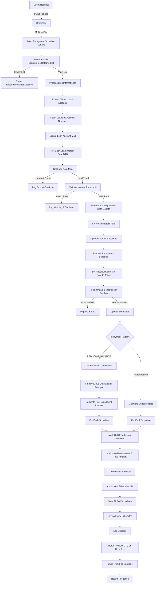
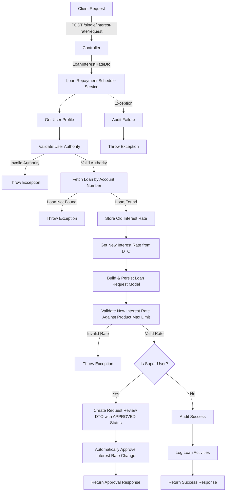
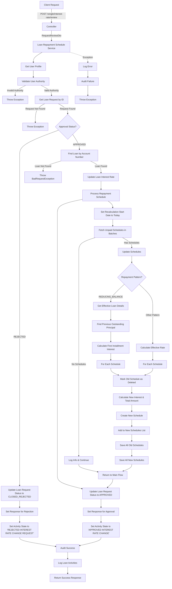

# Granular Explanation Of Bulk Loan Interest Rate Change Endpoint

This code implements a RESTful API endpoint for uploading an Excel file
containing loan accounts and interest rates, and then processing the loan repayment schedules
with the updated interest rates. Here's a detailed explanation:

### Controller Layer

- Defines a POST endpoint at `/upload`
- Accepts a MultipartFile parameter named "file"
- Calls the loan repayment schedule service's updateBulkLoanInterestRates method
- Wraps the result in a response map with status code, status description, and data
- Returns the response

### Service Layer - processAndLogInterestRateUpdate

- Logs the interest rate update
- Stores the old interest rate
- Updates the loan interest rate
- Calls processRepaymentSchedule to update the repayment schedule
- Logs the completion of the interest rate update

### Service Layer - processRepaymentSchedule

- Sets the recalculation start date to today
- Implements pagination to handle large numbers of schedules efficiently
- Fetches unpaid schedules in paginated batches
- For each batch:

  - If there are no schedules, breaks the loop
  - Calls updateSchedules to update the schedules
  - Increments the page counter
  - Continues until all pages are processed

### Service Layer - updateSchedules

- Creates a list for new schedules
- Handles different repayment patterns:

  - For REDUCING_BALANCE pattern:

    - Gets the effective loan details
    - Finds the previous outstanding principal
    - Calculates the first installment interest and total amount
    - For each schedule:

      - Marks the old schedule as deleted
      - Calculates the installment interest based on position
      - Creates a new schedule with updated values
      - Adds it to the list of new schedules

    - For other patterns (e.g.,FIXED or EQUAL REPAYMENT):

      - Calculates the effective rate
      - For each schedule:

        - Marks the old schedule as deleted
        - Calculates the installment interest and total amount
        - Creates a new schedule with updated values
        - Adds it to the list of new schedules

- Saves all the old schedules (marked as deleted) using soft delete principles
- Saves all the new schedules
- Logs the successful update

## Detailed Flow Diagram

# Granular Explanation Of Single Loan Interest Rate Change Request Endpoint

The service method is annotated with `@Transactional` to ensure database consistency and follows these steps:

### Controller Layer

- Defines a POST endpoint at `/single/interest-rate/request` for the maker of this request
- Accepts a LoanInterestRateDto in the request body
- Calls the loan repayment schedule service's updateSingleInterestRate method
- Returns the response

### Service Layer

The service method follows these steps:

1. **User Context**: Retrieves the current user profile
2. **Authorization Validation**:

   - Validates that the user has the right authority of INTEREST_RATE_MODIFICATION_REQUEST_AUTHORITY to update loan interest rates

3. **Loan Retrieval**:

   - Fetches the loan by account number
   - If not found, an exception would be thrown by the fetchLoan method

4. **Interest Rate Information**:

   - Stores the old interest rate from the loan
   - Gets the new interest rate from the DTO
   - Logs the interest rate change

5. **Request Creation**:

   - Builds and persists a loan request model with:

     - The loan information
     - The user profile
     - Request type INTEREST_RATE_MODIFICATION
     - The new interest rate

6. **Interest Rate Validation**:

   - Validates the new interest rate against the product maximum limit
   - If invalid, throws an exception

7. **Super User Logic**:

   - If the user is a super user:

     - Creates a request review DTO with APPROVED status
     - Calls automaticallyApproveInterestRate to approve the interest rate change immediately
     - Returns the approval response

   - If the user is not a super user:

     - Logs audit information for the successful request
     - Logs loan activities with state "INTEREST RATE MODIFICATION REQUEST"
     - Returns a success response indicating the request was created

8. **Exception Handling**:

   - Catches exceptions
   - Logs audit information for the failure
   - Rethrows the exception

## Detailed Flow Diagram

# Granular Explanation Of Single Loan Interest Rate Change Review Endpoint

This code implements a RESTful API endpoint for reviewing and approving/rejecting an interest rate change request for a single loan with the following components:

### Controller Layer

- Defines a POST endpoint at `/single/interest-rate/review` for the checker
- Accepts a RequestReviewDto in the request body
- Calls the loan repayment schedule service's reviewSingleInterestRate method
- Returns the response

### Service Layer - reviewSingleInterestRate

The service method is annotated with `@Transactional` to ensure database consistency and follows these steps:

1. **User Context**: Retrieves the current user profile
2. **Authorization Validation**:

   - Validates that the user has the right authority of INTEREST_RATE_MODIFICATION_REVIEW_AUTHORITY to review interest rate changes

3. **Request Retrieval**:

   - Gets the loan request using the request ID from the DTO
   - If not found, an exception would be thrown by the getTheLoanRequest method

4. **Approval Logic**:

   - If the approval status is REJECTED:

     - Updates and stores the loan request with status CLOSED_REJECTED and state IN_ISSUE
     - Sets response message to "Interest Rate Change Request Rejected"
     - Sets activity state to "REJECTED INTEREST RATE CHANGE REQUEST"
     - Sets activity comment to "Rejected interest rate change by "
     - Sets next action to "REJECTED"

   - If the approval status is APPROVED:

     - Finds the loan by loan account number
     - If not found, throws a BadRequestException
     - Updates the loan interest rate
     - Calls processRepaymentSchedule to update the repayment schedule
     - Updates and stores the loan request with status APPROVED and state APPROVED
     - Sets response message to "Interest Rate Change Request approved"
     - Sets activity state to "APPROVED INTEREST RATE CHANGE"
     - Sets activity comment to "Approved interest rate change by "
     - Sets next action to "APPROVED"

5. **Auditing and Logging**:

   - Logs audit information
   - Logs loan activities

6. **Exception Handling**:

   - Catches exceptions
   - Logs errors
   - Logs audit information for failures
   - Rethrows the exception

### Service Layer - processRepaymentSchedule

This method handles the updating of repayment schedules:

- Sets the recalculation start date to today
- Implements pagination to handle large numbers of schedules efficiently
- Fetches unpaid schedules in paginated batches
- For each batch:

  - If there are no schedules, breaks the loop
  - Calls updateSchedules to update the schedules
  - Increments the page counter
  - Continues until all pages are processed

### Service Layer - updateSchedules

This method handles the actual schedule updates based on the loan's repayment pattern:

- Creates a list for new schedules
- For REDUCING_BALANCE pattern:

- Gets the effective loan details
- Finds the previous outstanding principal
- Calculates the first installment interest and total amount
- For each schedule:

  - Marks the old schedule as deleted
  - Calculates the installment interest based on position
  - Creates a new schedule with updated values
  - Adds it to the list of new schedules

- For other patterns (e.g., FIXED or EQUAL REPAYMENT):

- Calculates the effective rate
- For each schedule:

  - Marks the old schedule as deleted
  - Calculates the installment interest and total amount
  - Creates a new schedule with updated values
  - Adds it to the list of new schedules

- Saves all the old schedules (marked as deleted) using soft delete principle
- Saves all the new schedules
- Logs the successful update

## Detailed Flow Diagram

