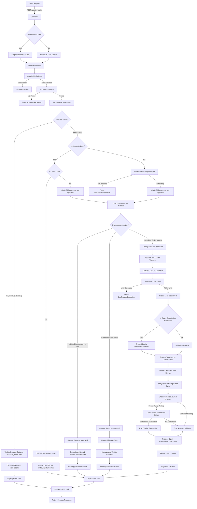
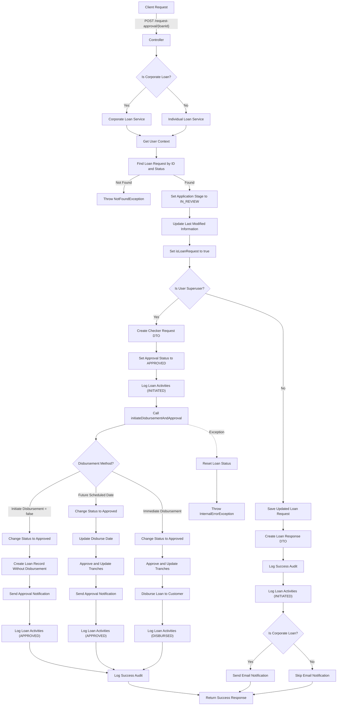

# Granular Explanation Of Loan Approval Endpoint

This code implements a RESTful API endpoint for confirming loan actions (approval or rejection) with the following components:

### Controller Layer

- Defines a POST endpoint at `/confirm-action`
- Accepts a LoanCheckerRequestDto in the request body and an optional loanType query parameter
- Uses the @DuplicatePrevention annotation to prevent duplicate submissions
- Routes to the appropriate service (corporate or individual) based on the loan type
- Returns the response from the service

### Service Layer (Corporate and Individual)

Both services follow a similar pattern:

1. **User Context and Concurrency Control**:

- Get the current user profile and token
- Acquire a Redis lock to prevent concurrent approvals of the same loan
- If lock acquisition fails, throw an exception

2. **Loan Request Retrieval**:

- Find the loan request by ID, application stage (IN_REVIEW), request status (ACTIVE), and isLoanRequest flag
- If not found, throw a NotFoundException

3. **Reviewer Information**:

- Set reviewer information (name, ID, branch, timestamp)

4. **Rejection Flow**:

- If approval status is IN_ISSUE (rejection):

  - Update application stage to IN_ISSUE and status to CLOSED_REJECTED
  - Update last modified information
  - Save the updated loan request
  - Generate in-app notification event (LOAN_APPROVAL_REJECTION_EVENT)
  - Send email notifications to borrower and initiator
  - Log a successful audit
  - Return a response with the updated loan request

5. **Approval Flow**:

- If approval status is APPROVED:

  - For credit line products:

    - Change loan object status to APPROVED
    - Create loan record without disbursement
    - Save the updated loan request
    - Log loan activities

- For regular loans:

  - Initiate disbursement and approval process
  - Log a successful audit
  - Return a response with the updated loan request

### Individual Loan Service - Specific Features

The individual loan service includes additional validation:

- Validates that the loan request type is BOOKING
- If not, throws a BadRequestException

### Corporate Loan Service - Specific Features

The corporate loan service has more complex disbursement handling:

- Supports credit line products (approved without disbursement)
- Handles tranched disbursements with AdhocTranche method

### Disbursement Process

The disbursement process is handled by the initiateDisbursementAndApproval method, which:

1. **Disbursement Method Determination**:

- If initiateDisbursement is false:

  - Change loan object status to APPROVED
  - Create loan record in the request table without disbursement
  - Save the updated loan request
  - Send loan approval notification
  - Log loan activities

- If disbursement date is in the future:

  - Change loan object status to APPROVED
  - Update disburse date
  - Approve and update tranches
  - Save the updated loan request
  - Send loan approval notification
  - Log loan activities

- If immediate disbursement:

  - Change loan object status to APPROVED
  - Approve and update tranches
  - Call disburseLoanToCustomer to handle the actual disbursement
  - Log loan activities

### Loan Disbursement Process

The disburseLoanToCustomer method (from the attachment) handles the actual disbursement with these steps:

1. **Portfolio Validation**:

- Validate that the loan doesn't exceed the portfolio limit

2. **Loan Detail Creation**:

- Create a LoanDetailDto with loan information

3. **Equity Contribution Handling**:

- Check if equity contribution is required and funded

4. **Tranche Processing**:

- Process each tranche that is approved and pending disbursement
- Create credit and debit entries for principal disbursement
- Apply upfront charges and taxes for the first tranche

5. **Journal Posting**:

- Check for failed journal postings
- If found, check the actual transaction status
- If transaction was successful, use the existing transaction
- If no transaction found, post a new journal entry
- Process equity contribution if required

6. **Persistence**:

- Persist loan updates after successful disbursement
- Handle any exceptions with transaction reversal

7. **Error Handling**:

- If any exception occurs, reverse any successful journal transactions
- Reset loan account if not a placement loan
- Log the error and throw an InternalErrorException

## Detailed Flow Diagram

# Loan Review Endpoint

This code implements a RESTful API endpoint for requesting loan approval with the following components:

### Controller Layer

- Defines a POST endpoint at `/request-approval/{loanId}`
- Accepts a loan ID in the path and an optional loanType query parameter
- Routes to the appropriate service (corporate or individual) based on the loan type
- Returns the response from the service

### Service Layer - Common Flow

Both services follow a similar pattern:

1. **User Context**: Retrieves the current user profile
2. **Loan Retrieval**: Finds the existing loan request by ID and PENDING_APPROVAL status
3. **Status Update**: Sets the application stage to IN_REVIEW
4. **Metadata Update**: Updates the last modified information
5. **Audit Preparation**: Creates an audit meta info object with loan details
6. **Audit Preparation**: Creates an audit meta info object with loan details
7. **Super User Logic**:

   - If the user is a super user:

     - Creates a checker request with APPROVED status
     - Logs loan activities
     - Initiates disbursement and approval directly
     - Records audit information
     - Returns response

   - If the user is not a super user:

     - Saves the updated loan request
     - Creates response DTO
     - Records audit information
     - Logs loan activities
     - For corporate loans, sends email notification
     - Returns response

## Detailed Flow Diagram

