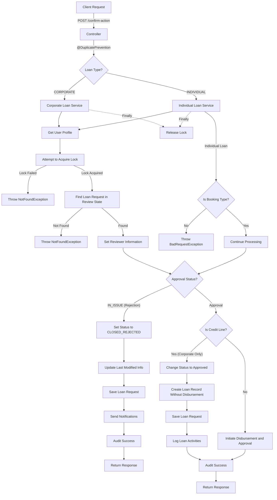

# Save To Draft Endpoint

This section implements a RESTful API endpoint for saving loan drafts with the following components:

### Controller Layer

- Defines a POST endpoint at `/confirm-action`
- Uses `@DuplicatePrevention` annotation to prevent duplicate submissions
- Accepts a loan checker request body and loan type parameter
- Routes the request to either corporate or individual loan service based on the loan type

### Service Layer (Corporate and Individual)

Both services follow a similar pattern:

1. **User Context**: Retrieves the current user profile and authentication token.
2. **Concurrency Control**:
   - Uses Redis to implement a distributed lock mechanism
   - Prevents multiple users from reviewing the same loan simultaneously
   - Sets an expiration time for the lock
3. **Loan Retrieval**: Finds the existing loan request by ID, application stage (IN_REVIEW), and active status
4. **Reviewer Information**: Sets reviewer details (name, ID, branch, timestamp)
5. **Audit Preparation**: Creates an audit meta info object with loan details
6. **Approval Logic**:

   - If approval status is `IN_ISSUE` (rejection):

     - Updates loan status to `CLOSED_REJECTED`
     - Sends notifications (in-app and email)
     - Logs audit information

   - If approval status is for approval:

     - For corporate loans that are credit lines:

     - Changes loan status to approved
     - Creates loan record without disbursement

   - For other loans:
     - Initiates disbursement and approval

## Detailed Flow Diagram

