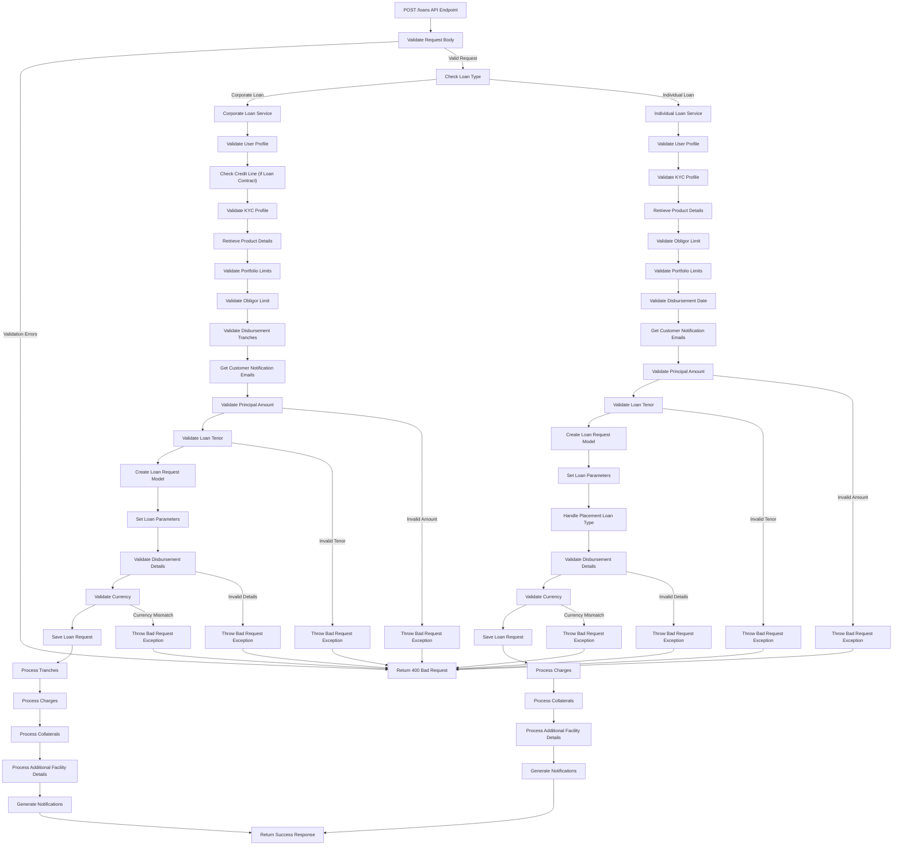
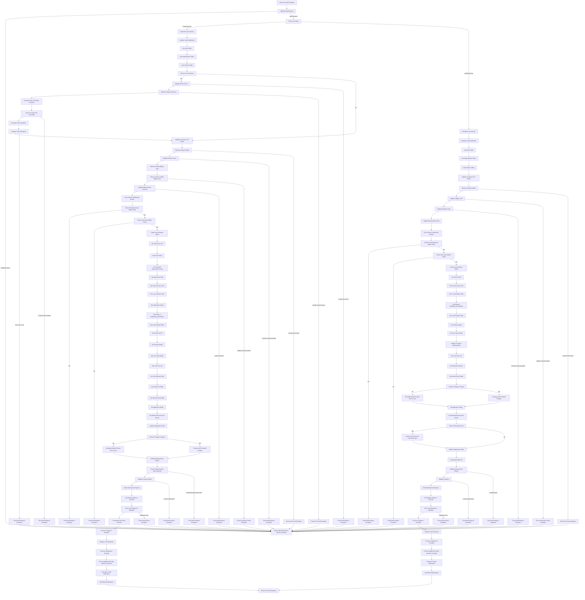

# Loan Booking Endpoint

The loan creation API follows these key steps:

### Request Validation:

1. The API first validates the incoming request body
1. If validation errors are found, it returns a 400 Bad Request response

### Loan Type Determination:

1. The system checks if the loan is a corporate or individual loan
1. Based on the loan type, it routes to the appropriate service

### Corporate Loan Processing :

1. Validates user profile and KYC information
1. For loan contracts, checks credit line details and limits
1. Retrieves product details and validates portfolio limits
1. Validates obligor limits, disbursement tranches, and notification details
1. Performs principal amount and loan tenor validation against product parameters
1. Creates and saves the loan request model with all necessary parameters
1. Processes tranches, charges, collaterals, and additional facility details
1. Generates notifications for reviewers/approvers

### Individual Loan Processing :

1. Similar to corporate loans but with some differences
1. Validates user profile, KYC, product details, and obligor limits
1. Validates disbursement date and portfolio limits
1. Handles placement loan types differently
1. Creates and saves the loan request model
1. Processes charges, collaterals, and additional facility details
1. Generates notifications

### Response Handling :

1. Both paths return a success response with loan details if successful
1. Various validation errors can occur at different stages, resulting in Bad Request responses

## Detailed Flow Diagram

