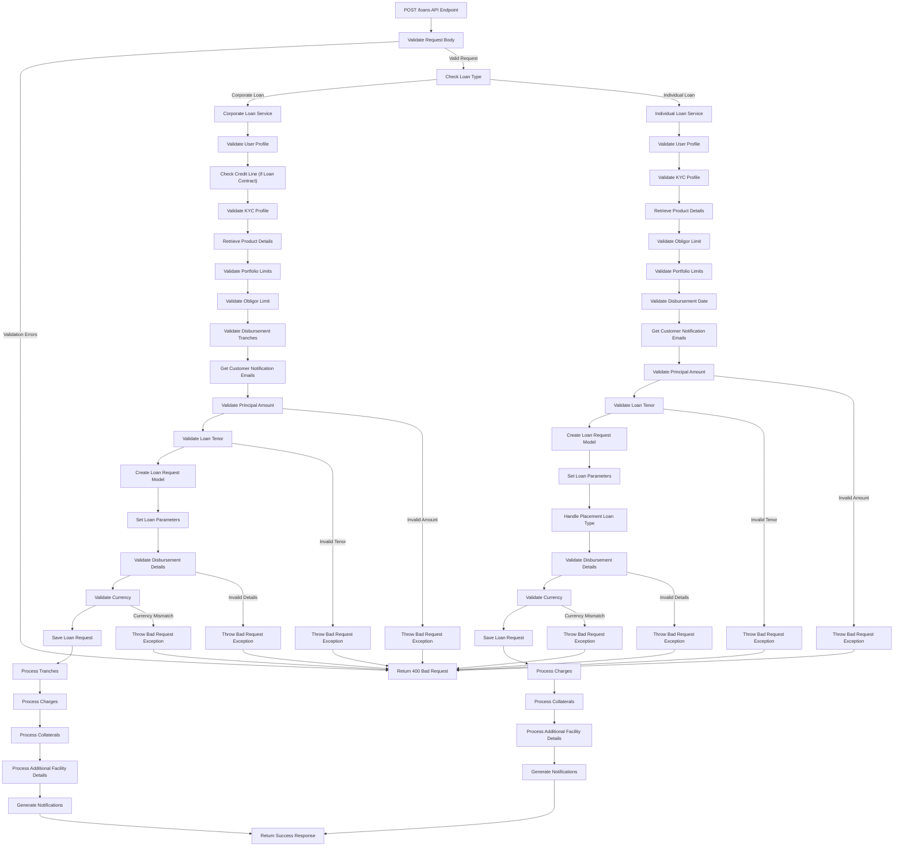

# Loan Booking Microservice

To render these in VS Code, you need to install an extension for Mermaid.

Some of these examples do not render properly in GitHub but they do in VS Code with the extension installed.

## Simple flowchart

