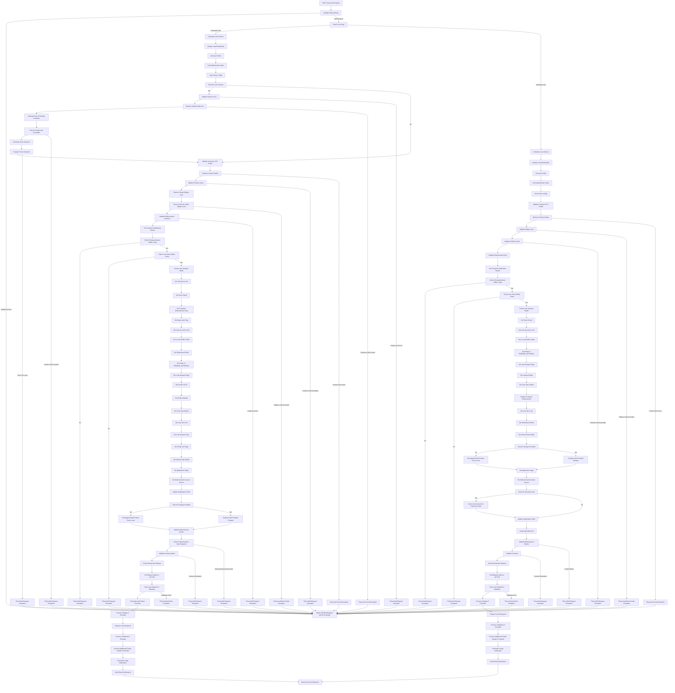

# Granular Explanation of the Loan Creation Process Endpoint

The loan creation API follows these key steps:

### 1. API Endpoint (Controller)

- The process begins with a POST request to the loan creation endpoint
- The endpoint is annotated with Swagger documentation (@Operation, @ApiResponses)
- It consumes and produces JSON data (APPLICATION_JSON_VALUE)
- The endpoint accepts three parameters:

  - RequestBodyWrapperDto (request body with loan details)
  - BindingResult (validation results)
  - LoanTypesEnum (optional query parameter for loan type)

### 2. Request Validation

- The controller first checks for validation errors in the request body
- If validation errors exist, it creates a ResponseStatusDto with error details
- It returns a 400 Bad Request response with the error details

### 3. Loan Type Determination

- The controller checks if the loan is a corporate loan using the isCorporateLoan method
- Based on the loan type, it routes to either:

  - corporateLoanService.createLoanRequest (for corporate loans)
  - loanService.createLoan (for individual loans)

### 4. Corporate Loan Processing

#### 4.1 Initial Setup

- Initializes JavaTimeModule for date handling
- Retrieves the current user profile
- Gets the authentication token
- Stores the token in a map for later use

### 4.2 Credit Line Validation (for Loan Contracts)

- Checks if the loan is a loan contract
- If yes, validates that the credit line ID is not null
- Retrieves the global credit line from the database
- Calculates the sum of existing loan contracts for the credit line
- Checks if adding the new loan would exceed the credit limit
- Calculates and compares tenor durations to ensure compliance

### 4.3 Customer and Product Validation

- Validates the customer's KYC profile
- Retrieves product details using the product ID
- Validates portfolio limits to ensure the loan doesn't exceed portfolio constraints
- Retrieves the global obligor limit
- Checks if the customer is within the allowed obligor limit

### 4.4 Disbursement Validation

- Validates disbursement tranches if tranched disbursement is enabled
- For adhoc tranches, checks percentages and dates
- For scheduled tranches, validates tenor periods and disbursement dates
- Gets customer notification emails for later use

#### 4.5 Principal and Tenor Validation

- Checks if the loan principal amount is within the product's min/max limits
- Checks if the loan tenor is within the product's min/max limits
- If either check fails, throws a BadRequestException

#### 4.6 Loan Request Model Creation

- Creates a new LoanRequestModel from the request data
- Sets numerous properties including:

  - Tenor period and tranched disbursement settings
  - Loan status (PENDING_APPROVAL)
  - Various flags (isLoanDraft, isLoanRequest, etc.)
  - Product and loan type details
  - Interest rate information
  - Application stage (INITIATED)

#### 4.7 Fee Configuration

- Checks if charges were provided in the request
- If not, sets applyDefaultProductFees to true to use product-defined fees
- Validates disbursement details including required dates
- Validates that the currency matches the product currency

#### 4.8 Save and Process

- Saves the loan request to the database
- Formulates and persists tranches if applicable
- Processes charges if provided
- Prepares the loan response
- Processes collaterals if provided
- Processes additional facility details if provided

#### 4.9 Notifications

- Generates in-app notification events
- Sends email notifications to reviewers/approvers
- Returns a success response with the loan details

### 5. Individual Loan Processing

#### 5.1 Initial Setup

- Similar to corporate loans: initializes JavaTimeModule, gets user profile and token

#### 5.2 Validations

- Validates the customer's KYC profile
- Retrieves product details
- Validates obligor limit
- Validates portfolio limits
- Validates disbursement date

#### 5.3 Principal and Tenor Validation

- Checks if the loan principal amount is within the product's min/max limits
- Checks if the loan tenor is within the product's min/max limits
- If either check fails, throws a BadRequestException

#### 5.4 Loan Request Model Creation

- Creates a new LoanRequestModel from the request data
- Sets numerous properties similar to corporate loans
- Disables tranched disbursement (not available for individual loans)

#### 5.5 Special Handling

- Checks if the loan is a placement loan
- If yes, extracts account number from product and sets as loan account number
- Updates gatekeeper fields
- Sets up audit meta information

#### 5.6 Save and Process

- Validates disbursement details and currency
- Saves the loan request to the database
- Processes charges, collaterals, and additional facility details
- Generates notifications
- Returns a success response

### 6. Error Handling

- Both flows include extensive error handling
- Specific exceptions are thrown for different validation failures:

  - BadRequestException for invalid inputs
  - NotFoundException for missing resources
  - InsufficientFundsException for limit violations
  - InternalErrorException for system errors

- All exceptions eventually result in appropriate HTTP responses

## Detailed Flow Diagram

