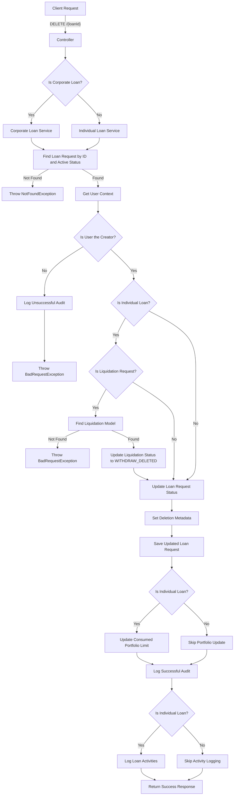
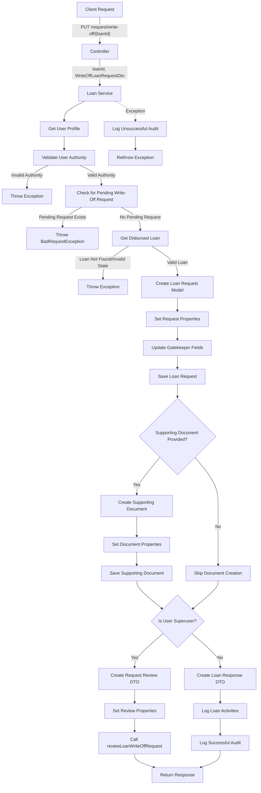
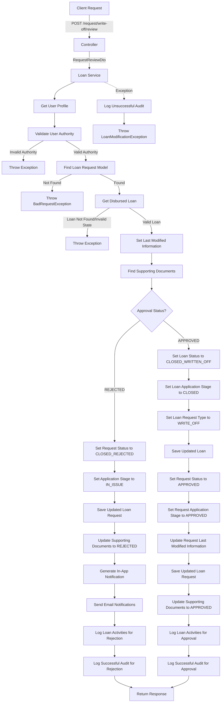

# Loan Deletion Endpoint

This code implements a RESTful API endpoint for deleting a loan with the following components:

### Controller Layer

- Defines a DELETE endpoint at `/{loanId}`
- Accepts a loan ID in the path and an optional loanType query parameter
- Determines if it's a corporate loan based on the loanType
- Routes to the appropriate service (corporate or individual)
- Returns the response from the service

### Service Layer

The individual loan service's deleteLoan method handles the deletion of individual loans with these steps:

1. **Loan Request Retrieval**:

   - Finds the loan request by ID and active status using the loanRequestRepository
   - If not found, throws a NotFoundException with a detailed message

2. **User Context and Authorization**:

   - Gets the current user profile
   - Validates that the user is the creator of the loan
   - If not, logs an unsuccessful audit and throws a BadRequestException

3. **Liquidation Request Handling**:

   - Checks if the loan is a liquidation request (full, partial, or overdraw)
   - If yes:

     - Finds the liquidation model by loan request ID, liquidation event, and pending approval status
     - If not found, throws a BadRequestException
     - Updates the liquidation status to WITHDRAW_DELETED
     - Sets reviewer information and review date
     - Saves the updated liquidation model

4. **Loan Request Update**:

   - Sets the request status to INACTIVE
   - Sets deletion metadata (who deleted it, when, etc.)
   - Sets application stage to DELETED
   - Updates last modified information
   - Sets isLoanRequest and isLoanRecord to false
   - Saves the updated loan request

5. **Portfolio Update**:

   - Updates consumed portfolio limit

6. **Audit and Logging**:

   - Logs a successful audit
   - Logs loan activities

7. **Response**:

   - Returns a ResponseBodyWrapperDto with status information and null data

### Service Layer - Corporate Loan Service

The corporate loan service's deleteLoan method handles the deletion of corporate loans with these steps:

1. **Loan Request Retrieval**:

   - Finds the loan request by ID and active status using the loanRequestRepository
   - If not found, throws a NotFoundException with a detailed message

2. **User Context and Authorization**:

   - Gets the current user profile
   - Validates that the user is the creator of the loan
   - If not, logs an unsuccessful audit and throws a BadRequestException

3. **Loan Request Update**:

   - Sets the request status to INACTIVE
   - Sets deletion metadata (who deleted it, when, etc.)
   - Sets application stage to DELETED
   - Updates last modified information
   - Sets isLoanRequest and isLoanRecord to false

4. **Audit**:

   - Logs a successful audit

5. **Response**:

   - Returns a ResponseBodyWrapperDto with status information and null data

## Detailed Flow Diagram

# Loan Write Off Request Endpoint

This code implements a RESTful API endpoint for requesting a loan write-off with the following components:

### Controller Layer

- Defines a PUT endpoint at `/request/write-off/{loanId}`
- Accepts a loan ID in the path and a WriteOffLoanRequestDto in the request body
- Calls the loan service's requestLoanWriteOff method
- Returns the response from the service

### Service Layer

The service method is annotated with `@Transactional(rollbackFor = Exception.class)` to ensure database consistency and follows these steps:

1. **User Context and Authorization**:

   - Gets the current user profile
   - Validates that the user has loan modification creation write-off authority
   - If not, an exception would be thrown by the validateThatUserHasLoanModificationCreationWriteOffAuthority method

2. **Pending Request Validation**:

   - Checks if there's a pending write-off request for the loan (with loan request type WRITE_OFF and application stage IN_REVIEW)
   - If yes, throws a BadRequestException with "There is a pending write off request on this loan"

3. **Loan Retrieval**:

   - Gets the disbursed loan by ID using the getDisbursedLoan method
   - If not found or not in the right state, an exception would be thrown by the getDisbursedLoan method

4. **Loan Request Creation**:

   - Creates a new loan request model from the loan model using modelMapper
   - Sets the loan ID, status (PENDING_APPROVAL), application stage (IN_REVIEW), and loan request type (WRITE_OFF)
   - Updates gatekeeper fields (creator, creation date, etc.)
   - Saves the loan request

5. **Supporting Document Handling**:

   - If a supporting document is provided in the request:

     - Creates a new supporting document
     - Sets the document details (request ID, document reference ID, file name, URL, etc.)
     - Sets the status to PENDING
     - Sets the loan ID and request type
     - Sets creation metadata
     - Saves the supporting document

6. **Superuser Auto-Approval**:

   - If the user is a superuser:

     - Creates a request review DTO
     - Sets the request ID, approval status (APPROVED), and approver comment
     - Calls reviewLoanWriteOffRequest to automatically approve the request
     - Returns the result of the review

7. **Regular User Flow**:

   - Creates a loan response body DTO
   - Logs loan activities with state "WRITE-OFF-REQUEST", comment "Loan write off request initiated by [username]", and next action "REVIEW"
   - Logs a successful audit
   - Returns a response with the loan response body DTO

8. **Exception Handling**:

   - Catches exceptions
   - Logs an unsuccessful audit
   - Rethrows the exception

## Detailed Flow Diagram

# Loan Write Off Review Endpoint

This code implements a RESTful API endpoint for reviewing a loan write-off request with the following components:

### Controller Layer

- Defines a POST endpoint at `/request/write-off/review`
- Accepts a RequestReviewDto in the request body
- Calls the loan service's reviewLoanWriteOffRequest method
- Returns the response from the service

### Service Layer

The service method is annotated with `@Transactional(rollbackFor = Exception.class)` to ensure database consistency and follows these steps:

1. **User Context and Authorization**:

   - Gets the current user profile
   - Validates that the user has loan modification write-off authority (with creation=false, review=true)
   - If not, an exception would be thrown by the validateThatUserHasLoanModificationCreationWriteOffAuthority method

2. **Loan Request Retrieval**:

   - Finds the loan request model by request ID, loan request type (WRITE_OFF), and application stage (IN_REVIEW)
   - If not found, throws a BadRequestException with "There is no pending write off request on this loan"

3. **Loan Retrieval**:

   - Gets the disbursed loan by loan ID using the getDisbursedLoan method
   - If not found or not in the right state, an exception would be thrown by the getDisbursedLoan method
   - Sets last modified information on the loan model (reviewer name, ID, and timestamp)

4. **Supporting Document Retrieval**:

   - Finds supporting documents for the request with status PENDING

5. **Rejection Flow**:

   - If the approval status is REJECTED:

     - Sets the loan request status to CLOSED_REJECTED and application stage to IN_ISSUE
     - Saves the updated loan request
     - Updates supporting document status to REJECTED
     - Generates in-app notification event (LOAN_APPROVAL_REJECTION_EVENT)
     - Sends email notifications to borrower and initiator
     - Logs loan activities with state "REJECT-WRITE-OFF-REQUEST", comment "Loan write off request rejected by [username]", and next action "CLOSED-REQUEST"
     - Logs a successful audit
     - Returns a response with the loan response body DTO

6. **Approval Flow**:

   - If the approval status is APPROVED:

     - Sets the loan model's loan request type to WRITE_OFF, application stage to CLOSED, and status to CLOSED_WRITTEN_OFF
     - Saves the updated loan model
     - Sets the loan request status to APPROVED and application stage to APPROVED
     - Updates last modified information on the loan request
     - Saves the updated loan request
     - Updates supporting document status to APPROVED
     - Logs loan activities with state "APPROVED-WRITE-OFF-REQUEST", comment "Loan write off request approved by [username]", and next action "CLOSED-WRITTEN-OFF"
     - Logs a successful audit
     - Returns a response with the loan response body DTO

7. **Exception Handling**:

   - Catches exceptions
   - Logs an unsuccessful audit
   - Throws a LoanModificationException with the error message and HTTP status INTERNAL_SERVER_ERROR

### Supporting Document Handling

The code includes a method to update supporting documents:

- Takes a list of supporting documents, a new status, reviewer name, and user profile
- For each document, updates the status, reviewer information, and review date
- Saves the updated documents

## Detailed Flow Diagram

