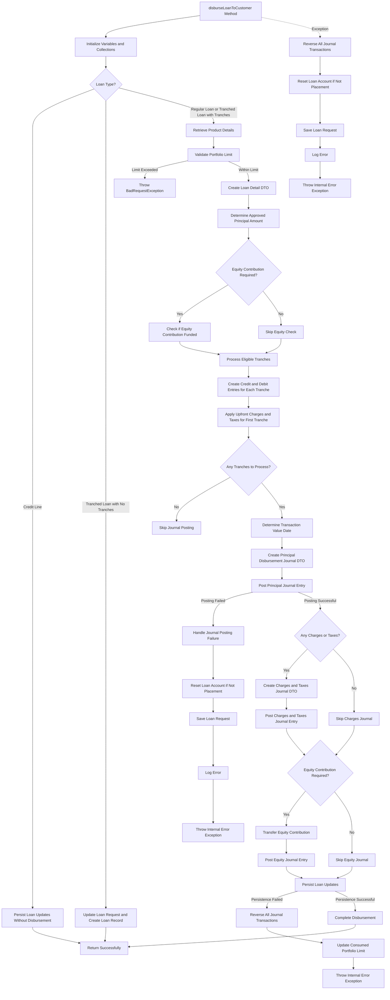

# Granular Explanation of The Loan Disbursement Process

The `disburseLoanToCustomer` method implements a comprehensive loan disbursement process with multiple paths depending on the loan type and configuration. Here's a detailed explanation of each component:

### 1. Initialization and Setup

- Gets the current user profile for auditing
- Initializes collections for credit/debit entries, charges, taxes, and equity contributions
- Tracks successful journal transaction IDs for potential reversal
- Determines disbursement type (tranched or principal)

### 2. Loan Type Handling

The method handles three main loan types differently:

#### Credit Line Loans

- For credit lines, persists loan updates without actual disbursement
- No funds are transferred as credit lines are just approved credit limits

#### Tranched Loans with No Tranches

- For tranched loans with no tranches yet defined, updates loan status to APPROVED
- Creates a loan record without disbursement
- This allows for future tranches to be added and disbursed

#### Regular Loans or Tranched Loans with Tranches

- Retrieves product details to validate portfolio limits
- Creates a loan detail DTO with comprehensive loan information
- Processes eligible tranches for disbursement

### 3. Tranche Processing

For each eligible tranche (approved and pending disbursement):

- Determines the recipient account number based on disbursement configuration
- Creates credit entries (to recipient account) and debit entries (from loan account)
- Updates tranche metadata (creator, creation date)
- For the first tranche only, applies upfront charges and taxes

### 4. Journal Entry Creation and Posting

The method creates and posts multiple types of journal entries:

#### Principal Disbursement Journal

- Creates a transaction journal DTO with principal credit and debit entries
- Posts the journal entry using the `postJournalEntry` method
- Tracks the transaction ID for potential reversal

#### Charges and Taxes Journal

- If charges or taxes exist, creates a separate journal entry
- Posts the charges journal entry
- Tracks the transaction ID for potential reversal

#### Equity Contribution Journal

- If equity contribution is required and funded, creates an equity journal entry
- Transfers equity contribution and principal amount to customer's account
- Tracks the transaction ID for potential reversal

### 5. Persistence and Completion

After successful journal posting:

- Calls `persistLoanUpdates` to update the loan record
- Updates tranche status, loan status, and related entities
- Completes the disbursement process

### 6. Error Handling and Recovery

The method implements robust error handling:

#### Journal Posting Failure

- If journal posting fails, resets the loan account (if not a placement loan)
- Saves the loan request with updated status
- Logs the error and throws an InternalErrorException

#### Persistence Failure

- If persistence fails after successful journal posting, reverses all journal transactions
- Updates consumed portfolio limit
- Logs the error and throws an InternalErrorException

#### General Exception Handling

- Catches any exceptions during the entire process
- Reverses all successful journal transactions
- Resets loan account if not a placement loan
- Saves the loan request with updated status
- Logs the error and throws an InternalErrorException

## Detailed Flow Diagram

