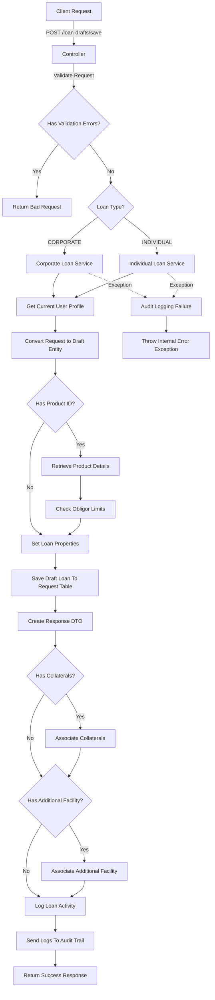
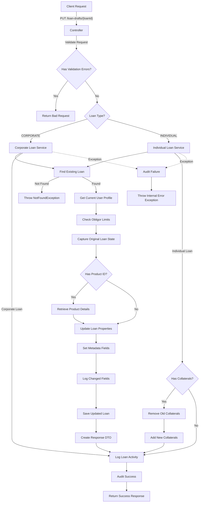

# Save To Draft Endpoint Granular Explanation

This section implements a RESTful API endpoint for saving loan drafts with the following components:

### Controller Layer

- Defines a POST endpoint at `/loan-drafts/save`
- Accepts a loan type parameter and request body
- Validates the request and handles validation errors
- Routes the request to either corporate or individual loan service based on the loan type

### Service Layer (Corporate and Individual)

Both services follow a similar pattern:

1. **User Context**: Retrieves the current user profile and authentication token
2. **Data Transformation**: Converts the request DTO to a loan entity
3. **Business Logic**:

4. If a product ID is provided:

5. Retrieves product details
6. Checks if the customer is within allowed obligor limits
7. Sets loan properties (application stage, status, type, etc.)

8. **Persistence**: Saves the loan draft to the database
9. **Relationship Handling**:

   - Associates collaterals with the loan if provided
   - Associates additional facility details if provided

10. **Auditing and Logging**:

    - Logs loan activities
    - Records audit information for successful operations

11. **Exception Handling**: Catches exceptions, logs audit information for failures, and throws a user-friendly error

## Detailed Flow Diagram

## Update Draft Endpoint

This section implements a RESTful API endpoint for saving loan drafts with the following components:

### Controller Layer

-Defines a PUT endpoint at `/loan-drafts/{loanId}`
-Accepts a loan ID path variable, loan type parameter, and request body
-Validates the request and handles validation errors
-Routes the request to either corporate or individual loan service based on the loan type

### Service Layer (Corporate and Individual)

Both services follow a similar pattern:

1. **User Context**: Retrieves the current user profile and authentication token
2. **Data Transformation**: Converts the request DTO to a loan entity
3. **Business Logic**:

4. If a product ID is provided:

5. Retrieves product details
6. Checks if the customer is within allowed obligor limits
7. Sets loan properties (application stage, status, type, etc.)

8. **Persistence**: Saves the loan draft to the database
9. **Relationship Handling**:

   - Associates collaterals with the loan if provided
   - Associates additional facility details if provided

10. **Auditing and Logging**:

    - Logs loan activities
    - Records audit information for successful operations

11. **Exception Handling**: Catches exceptions, logs audit information for failures, and throws a user-friendly error

## Detailed Flow Diagram

