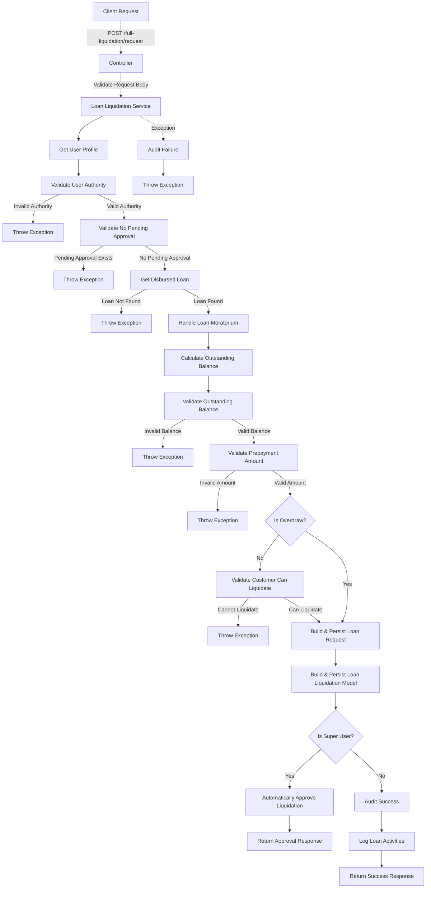
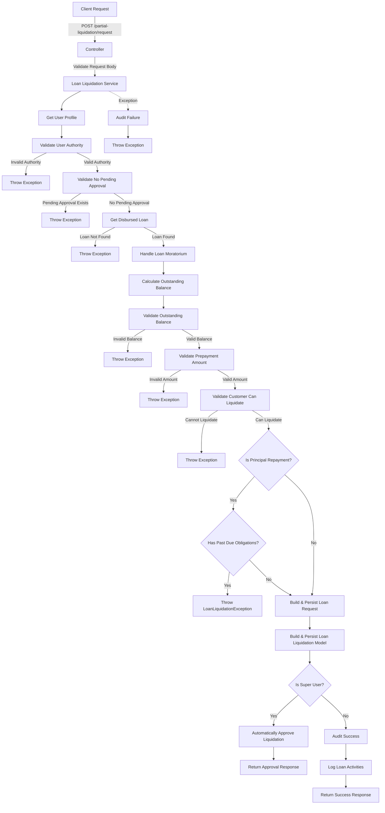
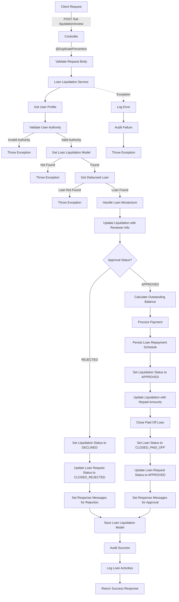
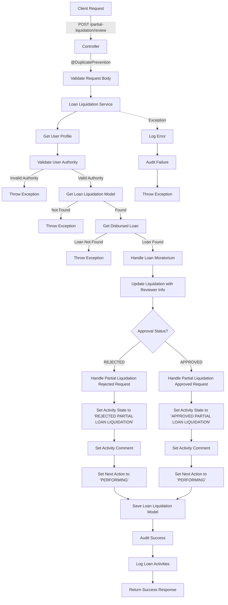

# Full Loan Liquidation Request Endpoint

This code implements a RESTful API endpoint for requesting a full loan liquidation with the following components:

### Controller Layer

- Defines a POST endpoint at `/full-liquidation/request`
- Accepts a loan liquidation request DTO
- Validates the request body using `@Valid` annotation
- Routes the request to the loan liquidation service's requestFullLoanLiquidation method

### Service Layer

The service method is annotated with `@Transactional(rollbackFor = Exception.class)` to ensure database consistency and `@SneakyThrows` to handle exceptions. It follows these steps:

1. **User Context**: Retrieves the current user profile
2. **Authorization Validation**:

   - Validates that the user has the right authority to request a loan liquidation

3. **Pending Approval Validation**:

   - Validates that there are no pending approval requests for the loan

4. **Loan Retrieval**:

   - Gets the disbursed loan by ID

5. **Moratorium Handling**:

   - If the loan has a moratorium requirement but no moratorium type, sets it to "Principal_and_interest"

6. **Balance Calculation**:

   - Calculates the outstanding balance of the loan

7. **Validation**:

   - Validates the outstanding balance
   - Validates that the prepayment amount is valid for a full liquidation
   - If not an overdraw liquidation, validates that the customer can liquidate the loan

8. **Request Creation**:

   - Builds and persists a loan request model with the appropriate request type (OVERDRAW_LIQUIDATION or FULL_LIQUIDATION)

9. **Liquidation Model Creation**:

   - Builds and persists a loan liquidation model with details of the liquidation

10. **Super User Logic**:

    - If the user is a super user:

      - Automatically approves the loan liquidation
      - Returns the approval response

    - If the user is not a super user:

      - Logs audit information
      - Logs loan activities
      - Returns a success response

11. **Exception Handling**: Catches exceptions, logs audit information for failures, and rethrows the exception

## Detailed Flow Diagram

# Partial Loan Liquidation Request Endpoint

This code implements a RESTful API endpoint for requesting a partial loan liquidation with the following components:

### Controller Layer

- Defines a POST endpoint at `/partial-liquidation/request`
- Accepts a loan liquidation request DTO
- Validates the request body using `@Valid` annotation
- Routes the request to the loan liquidation service's requestPartialLoanLiquidation method

### Service Layer

The service method is annotated with `@Transactional(rollbackFor = Exception.class)` to ensure database consistency and `@SneakyThrows` to handle exceptions. It follows these steps:

1. **User Context**: Retrieves the current user profile
2. **Authorization Validation**:

   - Validates that the user has the right authority to request a loan liquidation

3. **Pending Approval Validation**:

   - Validates that there are no pending approval requests for the loan

4. **Loan Retrieval**:

   - Gets the disbursed loan by ID

5. **Moratorium Handling**:

   - If the loan has a moratorium requirement but no moratorium type, sets it to "Principal_and_interest"

6. **Balance Calculation**:

   - Calculates the outstanding balance of the loan

7. **Validation**:

   - Validates the outstanding balance
   - Validates that the prepayment amount is valid for a partial liquidation
   - Validates that the customer can liquidate the loan
   - If it's a principal repayment, validates that there are no past due obligations

8. **Request Creation**:

   - Builds and persists a loan request model with the request type PARTIAL_LIQUIDATION

9. **Liquidation Model Creation**:

   - Builds and persists a loan liquidation model with details of the liquidation

10. **Super User Logic**:

    - If the user is a super user:

      - Automatically approves the loan liquidation
      - Returns the approval response

    - If the user is not a super user:

      - Logs audit information
      - Logs loan activities
      - Returns a success response

11. **Exception Handling**: Catches exceptions, logs audit information for failures, and rethrows the exception

## Detailed Flow Diagram

# Full Loan Liquidation Review Endpoint

This code implements a RESTful API endpoint for reviewing a full loan liquidation request with the following components:

### Controller Layer

- Defines a POST endpoint at `/full-liquidation/review`
- Uses `@DuplicatePrevention` annotation to prevent duplicate submissions
- Accepts a request review DTO
- Validates the request body using `@Valid` annotation
- Routes the request to the loan liquidation service's reviewFullLoanLiquidation method

### Service Layer

The service method is annotated with `@Transactional(rollbackFor = Exception.class)` to ensure database consistency and `@SneakyThrows` to handle exceptions. It follows these steps:

1. **User Context**: Retrieves the current user profile
2. **Authorization Validation**:

   - Validates that the user has the right authority to review loan liquidations

3. **Liquidation Retrieval**:

   - Gets the loan liquidation model by request ID

4. **Loan Retrieval**:

   - Gets the disbursed loan by ID from the liquidation model

5. **Moratorium Handling**:

   - If the loan has a moratorium requirement but no moratorium type, sets it to "Principal_and_interest"

6. **Reviewer Information**:

   - Updates the loan liquidation model with reviewer information (name, ID, date)

7. **Approval Logic**:

   - If the approval status is REJECTED:

     - Sets the liquidation status to DECLINED
     - Updates the loan request status to CLOSED_REJECTED and state to IN_ISSUE
     - Sets appropriate response messages and activity logs based on liquidation event type (OVERDRAW_LIQUIDATION or FULL_LIQUIDATION)

   - If the approval status is APPROVED:

     - Calculates the outstanding balance of the loan
     - Processes the payment
     - Persists the loan repayment schedule
     - Sets the liquidation status to APPROVED
     - Updates the liquidation with repaid amounts (principal, penalty, interest)
     - Closes the paid off loan
     - Sets the loan status to CLOSED_PAID_OFF and application stage to CLOSED
     - Updates the loan request type based on liquidation event
     - Updates the loan request status to APPROVED and state to APPROVED
     - Sets appropriate response messages and activity logs based on liquidation event type

8. **Persistence**:

   - Saves the updated loan liquidation model

9. **Auditing and Logging**:

   - Logs audit information
   - Logs loan activities

10. **Exception Handling**: Catches exceptions, logs errors, logs audit information for failures, and rethrows the exception

## Detailed Flow Diagram

# Partial Loan Liquidation Review Endpoint

This code implements a RESTful API endpoint for reviewing a full loan liquidation request with the following components:

### Controller Layer

- Defines a POST endpoint at `/partial-liquidation/review`
- Uses `@DuplicatePrevention` annotation to prevent duplicate submissions
- Accepts a request review DTO
- Validates the request body using `@Valid` annotation
- Routes the request to the loan liquidation service's reviewPartialLoanLiquidation method

### Service Layer

The service method is annotated with `@Transactional(rollbackFor = Exception.class)` to ensure database consistency and `@SneakyThrows` to handle exceptions. It follows these steps:

1. **User Context**: Retrieves the current user profile
2. **Authorization Validation**:

   - Validates that the user has the right authority to review loan liquidations

3. **Liquidation Retrieval**:

   - Gets the loan liquidation model by request ID

4. **Loan Retrieval**:

   - Gets the disbursed loan by ID from the liquidation model

5. **Moratorium Handling**:

   - If the loan has a moratorium requirement but no moratorium type, sets it to "Principal_and_interest"

6. **Reviewer Information**:

   - Updates the loan liquidation model with reviewer information (name, ID, date)

7. **Approval Logic**:

   - If the approval status is REJECTED:

     - Calls `handlePartLiquidationRejectedRequest` to handle the rejection
     - This method likely updates the loan liquidation status to DECLINED and the loan request status to CLOSED_REJECTED
     - Sets activity state to "REJECTED PARTIAL LOAN LIQUIDATION"
     - Sets activity comment to "Rejected partial loan liquidation by "
     - Sets next action to "PERFORMING"

   - If the approval status is APPROVED:

     - Calls `handlePartLiquidationApprovedRequest` to handle the approval
     - This method likely calculates the outstanding balance, processes the payment, updates repayment schedules, and updates the loan status
     - Sets activity state to "APPROVED PARTIAL LOAN LIQUIDATION"
     - Sets activity comment to "Approved partial loan liquidation by "
     - Sets next action to "PERFORMING"

8. **Persistence**:

   - Saves the updated loan liquidation model

9. **Auditing and Logging**:

   - Logs audit information
   - Logs loan activities

10. **Exception Handling**: Catches exceptions, logs errors, logs audit information for failures, and rethrows the exception

## Detailed Flow Diagram

