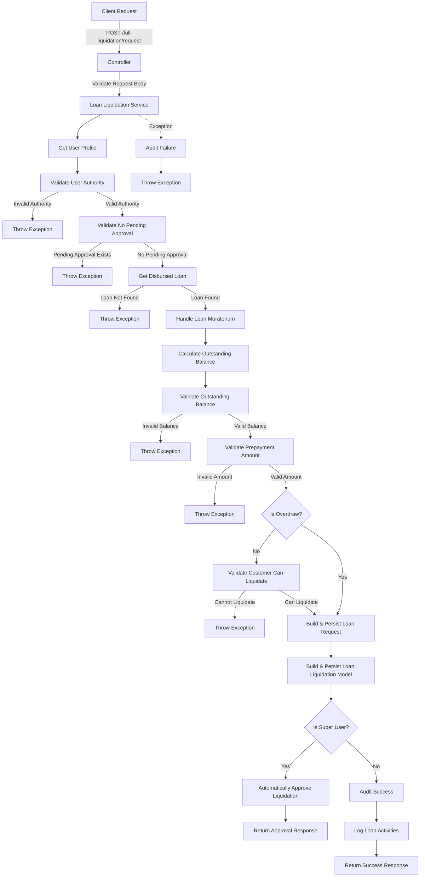

# Full Loan Liquidation Request Endpoint

This code implements a RESTful API endpoint for requesting a full loan liquidation with the following components:

### Controller Layer

- Defines a POST endpoint at `/full-liquidation/request`
- Accepts a loan liquidation request DTO
- Validates the request body using `@Valid` annotation
- Routes the request to the loan liquidation service's requestFullLoanLiquidation method

### Service Layer

The service method is annotated with `@Transactional(rollbackFor = Exception.class)` to ensure database consistency and `@SneakyThrows` to handle exceptions. It follows these steps:

1. **User Context**: Retrieves the current user profile
2. **Authorization Validation**:

   - Validates that the user has the right authority to request a loan liquidation

3. **Pending Approval Validation**:

   - Validates that there are no pending approval requests for the loan

4. **Loan Retrieval**:

   - Gets the disbursed loan by ID

5. **Moratorium Handling**:

   - If the loan has a moratorium requirement but no moratorium type, sets it to "Principal_and_interest"

6. **Balance Calculation**:

   - Calculates the outstanding balance of the loan

7. **Validation**:

   - Validates the outstanding balance
   - Validates that the prepayment amount is valid for a full liquidation
   - If not an overdraw liquidation, validates that the customer can liquidate the loan

8. **Request Creation**:

   - Builds and persists a loan request model with the appropriate request type (OVERDRAW_LIQUIDATION or FULL_LIQUIDATION)

9. **Liquidation Model Creation**:

   - Builds and persists a loan liquidation model with details of the liquidation

10. **Super User Logic**:

    - If the user is a super user:

      - Automatically approves the loan liquidation
      - Returns the approval response

    - If the user is not a super user:

      - Logs audit information
      - Logs loan activities
      - Returns a success response

11. **Exception Handling**: Catches exceptions, logs audit information for failures, and rethrows the exception

## Detailed Flow Diagram

