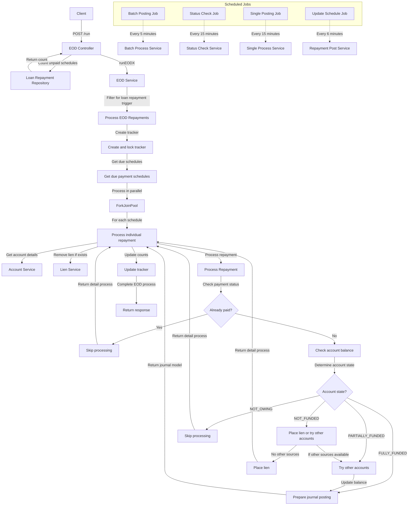

# EOD Loan Repayment Processing Endpoint

This system handles End-of-Day (EOD) processing for loan repayments through several key components

1. **API Endpoint**: The process starts with a POST request to `/run` with EOD trigger data.
2. **EOD Service**: Filters the triggers to find loan repayment activities and initiates processing.
3. **Repayment Processing**: The core process involves:

   - Creating a tracking record for the EOD run
   - Retrieving all due loan repayment schedules
   - Processing each repayment in parallel using a ForkJoinPool

4. **Individual Repayment Processing**:

   - Checks if the repayment is already paid
   - Retrieves account details and balance
   - Removes any existing liens
   - Determines account funding state (fully funded, partially funded, not funded)
   - Takes appropriate action based on funding state:

     - For fully funded accounts: Prepares journal posting details
     - For partially funded: Attempts to source funds from other accounts
     - For unfunded accounts: Places a lien or tries other funding sources

- Updates processing counts

6. **Scheduled Jobs**: Several background jobs run at regular intervals to:

   - Process batch journal postings (every 5 minutes)
   - Check status of batch postings (every 15 minutes)
   - Process single postings (every 15 minutes)
   - Update repayment schedules (every 6 minutes)

## Detailed Flow Diagram

