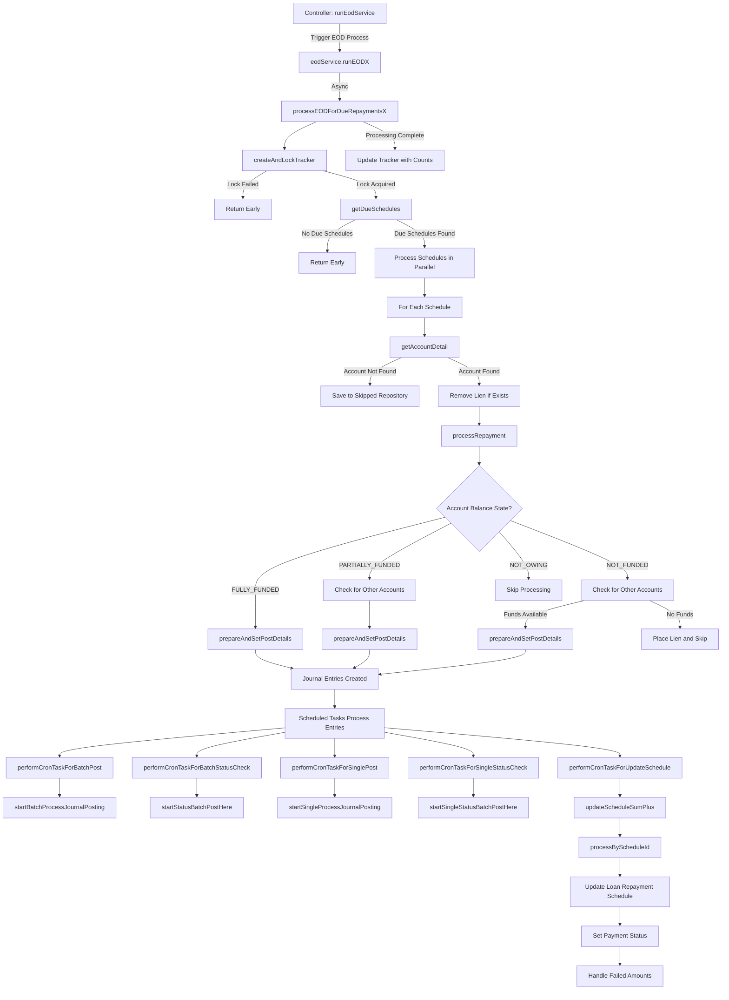

# Granular Explanation of EOD Loan Repayment Processing Endpoint

The provided code implements a sophisticated End-of-Day (EOD) loan repayment processing system that automatically handles due loan repayments. Here's a detailed explanation of the components and flow:

### 1. Controller Layer - Triggering EOD Process

The system starts with a REST endpoint that accepts EOD run trigger requests:

- Accepts a list of EODRunTriggerDto objects specifying which EOD activities to run
- Counts loans due for repayment
- Triggers the EOD process asynchronously
- Returns an immediate response while processing continues in the background

### 2. EOD Service - Orchestrating the Process

The EOD service orchestrates the overall process:

- Filters the EOD triggers to find the loan repayment trigger
- Calls processEODForDueRepaymentsX with the COB (Close of Business) date
- Runs asynchronously to avoid blocking the client

### 3. Process EOD For Due Repayments

This is the core method that handles the repayment processing:

#### a. Tracker Management

- Creates and locks a tracker to prevent duplicate processing
- Generates a unique run ID for tracking the process
- If locking fails (another process is running), returns early with a message that "There is an ongoing process that started"

#### b. Due Schedule Retrieval

- Retrieves all unpaid loan repayment schedules that are ('DUE', 'LATE', 'PARTIALLY_PAID') with loan status of ('DISBURSED', 'EXPIRED)
- For individual processing, filters by loan ID
- Removes duplicates based on schedule ID
- If no schedules are found, returns early

#### c. Parallel Processing

- Uses a ForkJoinPool to process schedules in parallel
- Tracks counts of processed, skipped, and total items

#### d. Account Detail Retrieval

For each schedule:

- Retrieves account details from the account retriever client
- If account not found, saves to skipped repository and continues
- Removes any existing lien before processing

#### e. Repayment Processing

The processRepayment method handles the actual repayment logic:

- Checks if the schedule is already paid
- Gets available balance and account state
- Handles different account balance states:

  - FULLY_FUNDED: Account has enough funds to cover the full repayment
  - PARTIALLY_FUNDED: Account has some funds but not enough for full repayment
  - NOT_FUNDED: Account has no funds for repayment
  - NOT_OWING: No repayment is due

#### f. Balance Handling Strategies

- For PARTIALLY_FUNDED or NOT_FUNDED states, tries to find funds from other customer accounts if it is enable on booking
- If funds are available in the customer account with the same currency validation in place, we sweep the funds into the customer loan account
- If funds are available, prepares and sets post details
- If no funds are available, places a lien on the account for future collection

#### g. Journal Entry Creation

- Creates journal entries for successful repayments
- Tracks these entries for batch processing

### 4. Scheduled Tasks - Processing Journal Entries

The system uses several scheduled tasks to process the created journal entries:

#### a. Batch Posting

- Runs every 5 minutes
- Retrieves unprocessed journal entries in batches with batch post status of NOT_PROCESSED
- Posts them to the core banking system through journal posting.
- All responses after this transaction is given BATCH_SUCCESS status

#### b. Batch Status Check

- Runs every 15 minutes
- Checks the status of batch-posted journal entries with BATCH_SUCCESS status
- Updates entries based on their status
- After the status, we can have either SUCCESS, FAILED, NOT_POSTED, NOT_POSTED_AND_NOT_SURE depending on the response from journal posting at the time.

#### c. Single Posting

- Runs every 15 minutes
- Processes failed batch entries and hard currencies repayments individually
- Posts them to the core banking system

#### d. Single Status Check

- Runs every 15 minutes
- Checks the status of individually posted journal entries
- Updates entries based on their status

#### e. Schedule Update

- Runs every 6 minutes
- Updates loan repayment schedules based on processed journal entries
- Calculates payment status (PAID, PARTIALLY_PAID)
- Handles any failed amounts by placing liens

### 5. Schedule Update Process

The updateScheduleSumPlus method handles the final update of loan repayment schedules:

- Retrieves finished process runs
- Groups them by schedule ID
- For each schedule:

  - Calculates total paid amounts (principal, interest, penalty)
  - Determines payment status based on the difference between owed and paid amounts
  - Updates the loan repayment schedule
  - Handles any failed amounts by adding to existing liens or creating new ones

## Detailed Flow Diagram

