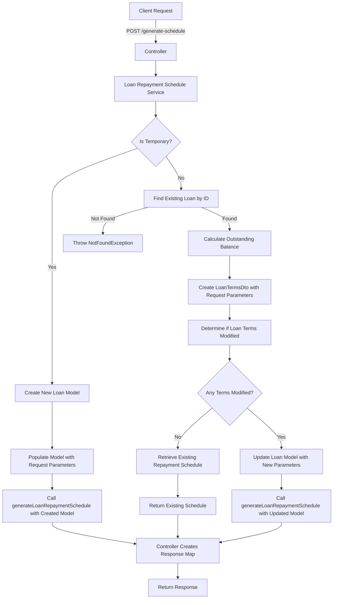
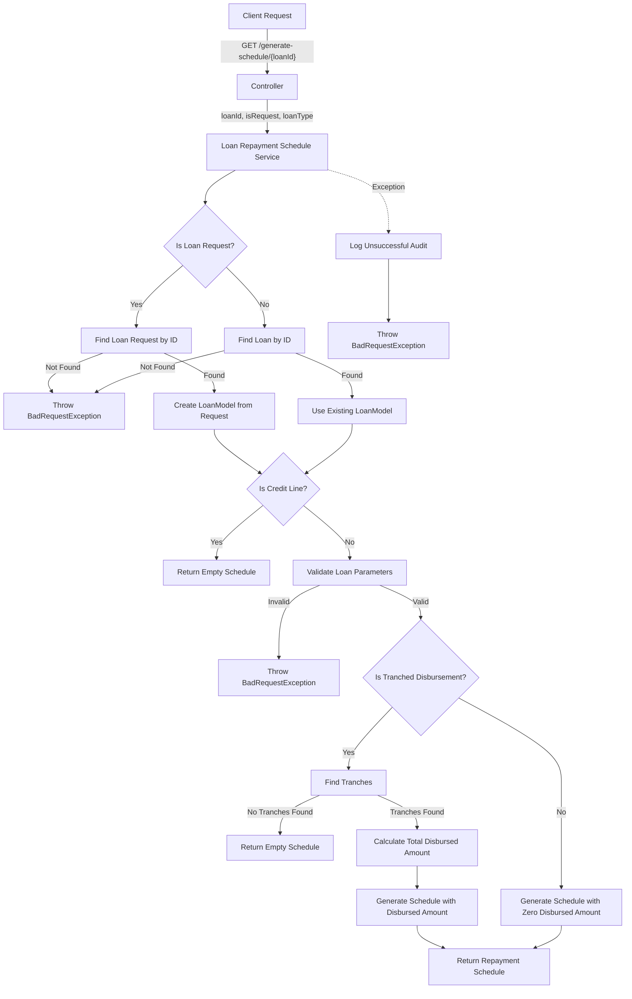
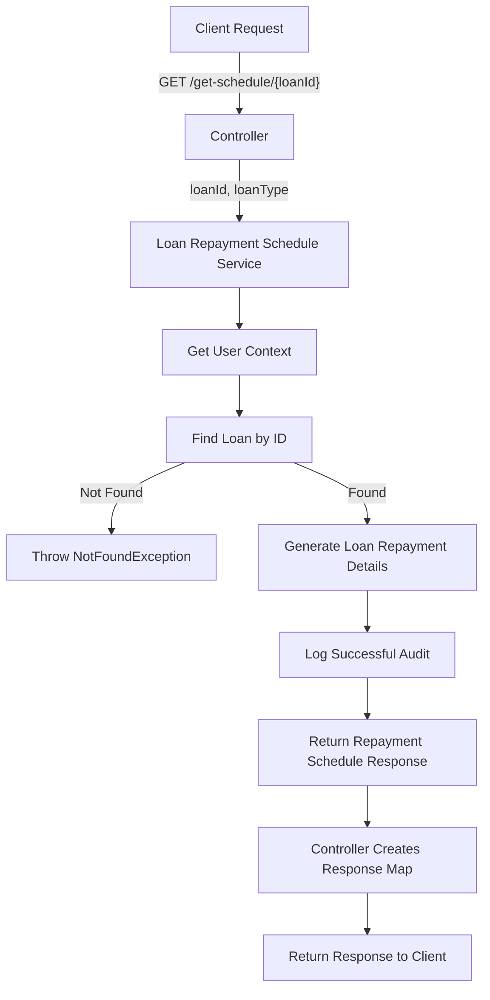

# Loan Repayment Schedule Generation Endpoint

This code implements a RESTful API endpoint for generating a loan repayment schedule using loan terms with the following components:

### Controller Layer

- Defines a POST endpoint at `/generate-schedule`
- Accepts a repayment schedule request DTO
- Calls the loan repayment schedule service's generateLoanRepaymentSchedule method
- Wraps the result in a response map with status code, status description, and data
- Returns the response

### Service Layer

The service method follows these steps:

1. **Request Type Determination**:

   - Checks if the request is for a temporary schedule (isTemporary flag)

2. **Temporary Schedule Generation**:

   - If it's temporary:

     - Creates a new LoanModel
     - Populates it with the request parameters (interest rate, tenor, moratorium, repayment frequency, etc.)
     - Handles custom start date if provided
     - Calls generateLoanRepaymentSchedule with the created model

3. **Existing Loan Schedule Generation**:

   - If it's not temporary:

     - Finds the existing loan by ID
     - If not found, throws a NotFoundException
     - Calculates the outstanding balance using the loanOutstandingBalanceCalculator
     - Creates a LoanTermsDto with the request parameters
     - Determines if any loan terms were modified using commonUtil.determineLoanTerms

   - If no terms were modified:

     - Retrieves the existing repayment schedule for the loan with NOT_DUE status
     - Maps the models to DTOs and returns them

   - If terms were modified:

     - Updates the loan model with the new parameters
     - Handles custom start date if provided
     - Calls generateLoanRepaymentSchedule with the updated model

4. **Schedule Generation**:

   - The actual schedule generation happens in another method (not shown in the provided code)
   - The method likely calculates installment amounts, due dates, and other repayment details based on the loan terms

## Detailed Flow Diagram

# Loan Repayment Schedule Generation For A Single Loan Endpoint

This code implements a RESTful API endpoint for generating a repayment schedule for a loan with the following components:

### Controller Layer

- Defines a GET endpoint at `/generate-schedule/{loanId}`
- Accepts a loan ID in the path and optional query parameters (isRequest and loanType)
- Calls the loan repayment schedule service's generateLoanRepaymentSchedule method
- Returns a response with status code, description, and the generated schedule data

### Service Layer

The service method handles the generation of loan repayment schedules with these steps:

1. **Request Type Determination**:

   - Determines if this is for a loan request or an existing loan based on the isRequest parameter
   - Creates appropriate Optional objects for loan or loan request

2. **Entity Retrieval**:

   - If it's a loan request:

     - Finds the loan request by ID
     - If not found, throws a BadRequestException with "Loan request not found"

   - If it's an existing loan:

     - Finds the loan by ID
     - If not found, throws a BadRequestException with "Loan not found"

3. **Existing Loan Processing**:

   - If a loan is found:

     - Checks if it's a credit line (returns empty schedule if true)
     - Validates loan repayment pattern, frequency, tenor, and tenor value

   - If invalid, throws a BadRequestException

     - Checks if tranched disbursement is enabled:

       - If yes, finds all tranches for the loan
       - If no tranches found, returns an empty schedule
       - If tranches found, calculates total disbursed amount and generates schedule

   - If tranched disbursement is not enabled, generates schedule with zero disbursed amount

4. **Loan Request Processing**:

   - If a loan request is found:

     - Creates a new LoanModel and copies properties from the loan request
     - Sets the request ID
     - Performs the same validation and schedule generation as for an existing loan

5. **Error Handling**:

   - If neither loan nor loan request is found:

     - Gets the current user profile, token, and HTTP request
     - Logs an unsuccessful audit
     - Throws a BadRequestException with a detailed message

## Detailed Flow Diagram

# Loan Repayment Schedule Retrieval Endpoint

This code implements a RESTful API endpoint for retrieving the repayment schedule list for a loan with the following components:

### Controller Layer

- Defines a GET endpoint at `/get-schedule/{loanId}`
- Accepts a loan ID in the path and an optional loanType query parameter
- Calls the loan repayment schedule service's getLoanRepaymentScheduleList method
- Creates a response map with status code, description, and the retrieved schedule data
- Returns the response map as a ResponseEntity

### Service Layer

The service method handles the retrieval of loan repayment schedules with these steps:

1. **User Context**:

   - Gets the current user profile, token, and HTTP request for auditing purposes

2. **Loan Retrieval**:

   - Finds the loan by ID using the loanRepository
   - If not found, throws a NotFoundException with a detailed message

3. **Repayment Details Generation**:

   - Calls generateLoanRepaymentDetails method to generate the loan repayment details
   - This method likely retrieves the existing repayment schedules from the database and formats them into a response DTO

4. **Audit Logging**:

   - Logs a successful audit with details about the operation, loan account, principal, product name, customer number, and account number

5. **Response**:

   - Returns the LoanRepaymentScheduleResponseDto containing the repayment schedule details

## Detailed Flow Diagram

