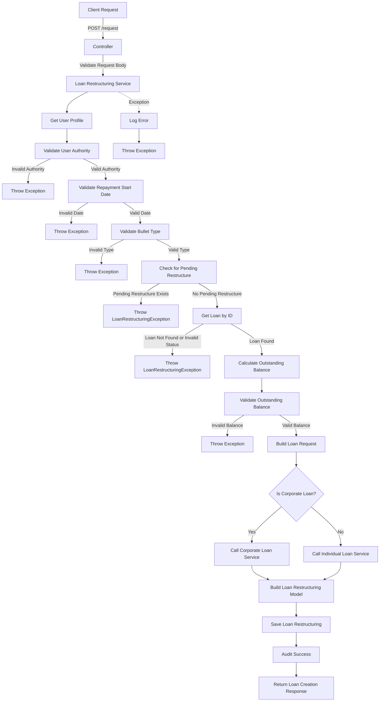
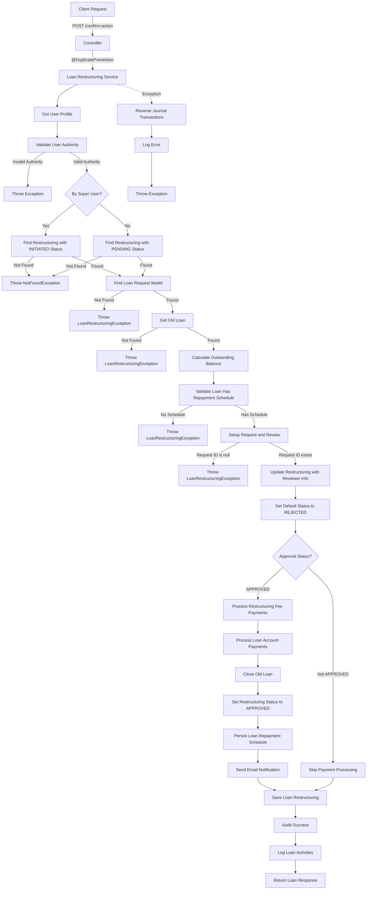
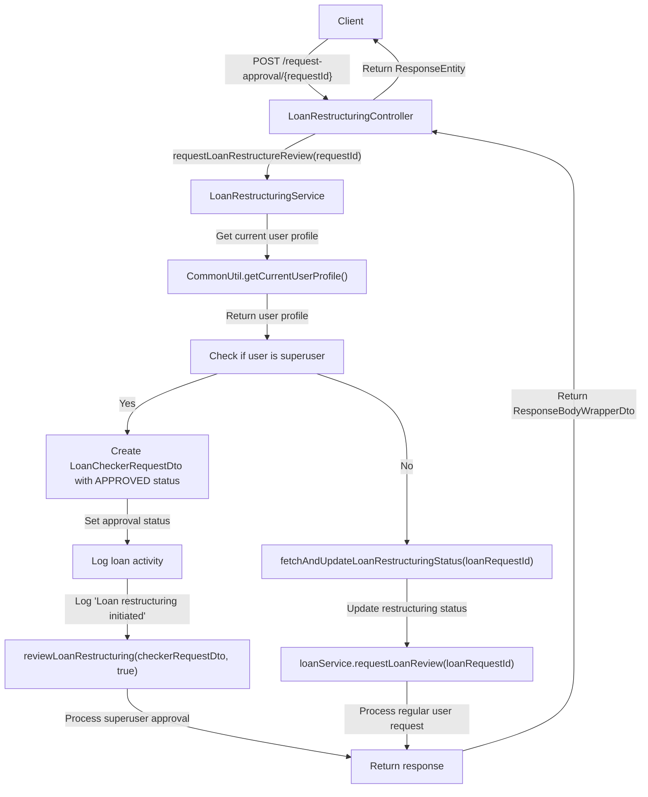

# Loan Restructuring Request Endpoint

This code implements a RESTful API endpoint for requesting a loan restructuring with the following components:

### Controller Layer

- Defines a POST endpoint at `/request`
- Accepts a loan restructure request DTO
- Validates the request body using `@Valid` annotation
- Routes the request to the loan restructuring service's requestLoanRestructuring method

### Service Layer

The service method is annotated with `@Transactional(rollbackFor = Exception.class)` to ensure database consistency and follows these steps:

1. **User Context**: Retrieves the current user profile and authentication token
2. **Authorization Validation**:

   - Validates that the user has the right authority to request a loan restructuring

3. **Request Validation**:

   - Validates the repayment start date in the request
   - Validates the bullet type in the request

4. **Pending Restructure Check**:

   - Checks if there's a pending restructure request for the loan
   - If a pending request exists, throws a LoanRestructuringException

5. **Loan Retrieval**:

   - Gets the loan by ID and validates it's either disbursed or expired
   - If the loan is not in the correct status, throws a LoanRestructuringException

6. **Balance Calculation**:

   - Calculates the outstanding balance of the loan

7. **Balance Validation**:

   - Validates that the outstanding balance in the request matches the calculated balance

8. **Loan Request Creation**:

   - Builds a loan request wrapper with the restructuring details
   - Determines if the loan is a corporate or individual loan
   - Calls the appropriate service to create a new loan request

9. **Restructuring Model Creation**:

   - Builds a loan restructuring model with details of the restructuring
   - Persists the loan restructuring model

10. **Auditing**: Records audit information for the successful operation
11. **Exception Handling**: Catches exceptions, logs errors, and throws appropriate exceptions

## Detailed Flow Diagram

# Loan Restructuring Review Endpoint

This code implements a RESTful API endpoint for reviewing and confirming actions for a restructured loan request with the following components:

### Controller Layer

- Defines a POST endpoint at `/confirm-action`
- Uses `@DuplicatePrevention` annotation to prevent duplicate submissions
- Accepts a loan checker request DTO
- Routes the request to the loan restructuring service's reviewLoanRestructuring method with `byASuperUser` set to false

### Service Layer

The service method is annotated with `@Transactional(rollbackFor = Exception.class)` to ensure database consistency and follows these steps:

1. **User Context**: Retrieves the current user profile and authentication token
2. **Authorization Validation**:

   - Validates that the user has the right authority to review loan restructurings

3. **Restructuring Retrieval**:

   - If by a super user, finds the loan restructuring by request ID and INITIATED status
   - If not by a super user, finds the loan restructuring by request ID and PENDING status
   - If not found, throws a NotFoundException

4. **Loan Request Retrieval**:

   - Finds the loan request model by request ID and PENDING_APPROVAL status
   - If not found, throws a LoanRestructuringException

5. **Old Loan Retrieval**:

   - Gets the old loan by ID and validates it's either disbursed or expired
   - If not found, throws a LoanRestructuringException

6. **Balance Calculation**:

   - Calculates the outstanding balance of the old loan

7. **Repayment Schedule Validation**:

   - Validates that the loan has a repayment schedule
   - If no schedule exists, throws a LoanRestructuringException

8. **Request Setup and Review**:

   - Sets up the request and reviews it
   - If the request ID is null, throws a LoanRestructuringException

9. **Reviewer Information**:

   - Updates the loan restructuring with reviewer information
   - Sets the default status to REJECTED

10. **Approval Logic**:

    - If the approval status is APPROVED:

      - Processes restructuring fee payments
      - Processes loan account payments
      - Closes the old loan (sets status to CLOSED_RESCHEDULED)
      - Updates the loan restructuring status to APPROVED
      - Persists the loan repayment schedule
      - Sends email notification

11. **Persistence**:

    - Saves the updated loan restructuring

12. **Auditing and Logging**:

    - Logs audit information
    - Logs loan activities

13. **Exception Handling**:

    - Catches exceptions
    - Reverses any journal transactions that were successful
    - Logs errors
    - Rethrows appropriate exceptions

## Detailed Flow Diagram

# Loan Restructuring Approval Request Endpoint

### API Endpoint

- **Endpoint**: `POST /request-approval/{requestId}`
- **Controller**: `LoanRestructuringController`
- **Purpose**: Initiates a request for loan restructuring approval
- **Input**: Loan request ID (UUID)
- **Output**: ResponseBodyWrapperDto containing LoanResponseBodyDto

### Process Flow

1. **Client Request Initiation**:

   - Client sends a POST request to `/request-approval/{requestId}`
   - The request contains the UUID of the loan restructuring request

2. **Controller Processing**:

   - The controller receives the request and extracts the request ID
   - It calls the service method `requestLoanRestructureReview` with the request ID

3. **User Authentication & Authorization**:

   - The service retrieves the current user's profile using `CommonUtil.getCurrentUserProfile()`
   - The system checks if the user is a superuser (has elevated privileges)

4. **Superuser Path** (If user is a superuser):

   - A `LoanCheckerRequestDto` is created with:

   - Approval status set to `APPROVED`
   - Request ID set to the provided loan request ID
   - Approver comment set to "Superuser approval"

   - The system logs the loan activity with:

     - Status: "INITIATED"
     - Description: "Loan restructuring initiated by [user's firstname]"
     - Action: "REVIEW"

   - The system calls `reviewLoanRestructuring` with the checker request DTO and `true` flag
   - This effectively auto-approves the restructuring request

5. **Regular User Path** (If user is not a superuser):

   - The system calls `fetchAndUpdateLoanRestructuringStatus` to update the status of the loan restructuring request
   - Then it calls `loanService.requestLoanReview` to initiate the standard review process
   - This puts the request into a queue for approval by authorized personnel

6. **Response Handling**:

   - The service returns a `ResponseBodyWrapperDto` containing loan response data
   - The controller wraps this in a `ResponseEntity` with HTTP 200 status
   - The response is sent back to the client

## Detailed Flow Diagram

