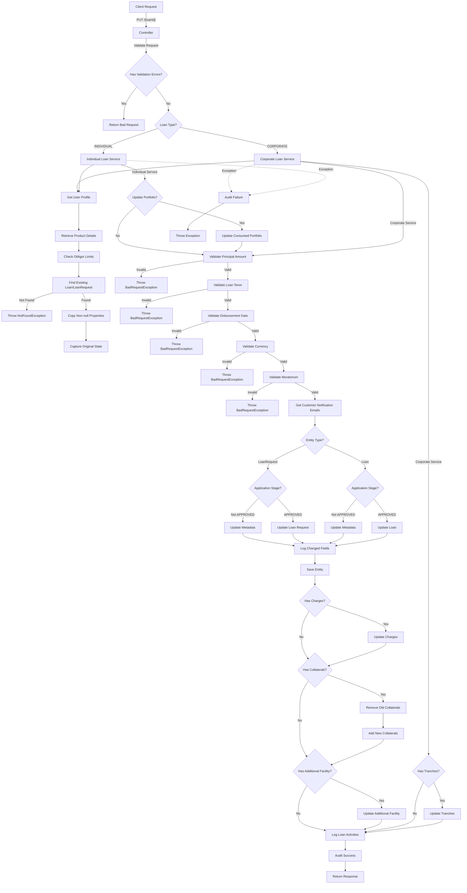

# Loan Update Endpoint

This code implements a RESTful API endpoint for updating loans with the following components:

### Controller Layer

- Defines a PUT endpoint at `/{loanId}`
- Accepts a loan ID path variable, request body, and loan type parameter
- Validates the request and handles validation errors
- Routes the request to either corporate or individual loan service based on the loan type

### Service Layer (Corporate and Individual)

Both services follow a similar pattern with extensive validation and business logic:

1. **User Context**: Retrieves the current user profile and authentication token
2. **Product Validation**:

   - Retrieves product details for the loan
   - Checks obligor limits

3. **Entity Retrieval**:

   - Attempts to find either a loan request or a loan entity by ID
   - Throws NotFoundException if neither exists

4. **Data Transformation**:

   - Copies non-null properties from the request to the entity
   - Captures the original state for change tracking

5. **Portfolio Management** (Individual service only):

   - Updates consumed portfolio if principal amount changes

6. **Business Rule Validation**:

   - Validates principal amount is within product min/max
   - Validates loan tenor is within product min/max
   - Validates disbursement date if required
   - Validates currency matches product currency
   - Validates moratorium value if requested

7. **Entity Update Logic**:

   - Different handling based on entity type (loan request vs. loan)
   - Different handling based on application stage (approved vs. not approved)
   - Updates metadata (last modified info)
   - Sets application stage to IN_REVIEW if not already approved
   - For loan requests, updates interest rate information

8. **Change Tracking**:

   - Logs the fields that have changed between the original and updated entity
   - Stores the changed fields in the entity

9. **Persistence**: Saves the updated entity
10. **Related Entity Management**:

    - Updates charges if provided
    - Removes old collaterals and adds new ones if provided
    - Updates additional facility details if provided
    - For corporate loans, handles tranches (removing old ones and adding new ones)

11. **Auditing and Logging**:

    - Logs loan activities
    - Records audit information for successful operations

12. **Exception Handling**: Catches exceptions, logs audit information for failures, and rethrows the exception

## Detailed Flow Diagram

